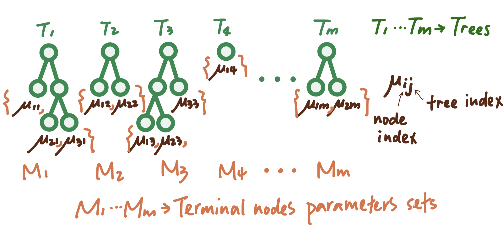

# The Methodology

## Setting up

We consider the fundamental problem of making inference about an unknown
function f that predicts an output Y using a $p$-dimensional vector of
inputs $x = (x_1, ..., x_p)$ when
$$Y = f(x) + \epsilon, \text{with } \epsilon \sim N(0, σ^2)$$.

To do this, we consider modeling or at least approximating
$f(x) = E(Y | x)$, the mean of $Y$ given $x$, by a sum of $m$ regression
trees $$f(x) \approx h(x) ≡ \sum_{j=1}^m g_j(x) $$ ,where each $g_j$
denotes the mapping function associated with the $j_{th}$ tree.

```{r, echo=FALSE, fig.cap="A visual representation of $g(x;T_j, M_j)$ . Square boxes represent the splitting rules, while circles denote the terminal nodes. ", out.width = '60%', fig.align = 'center'}

```

Getting into more details, let $T$ denote the set of all binary
regression trees, and a full list of $m$ trees can be denoted as the set
$T = \{T_1, T_2, T_3, ...\}$ For a specific binary regression tree $T_j$
that has $b$ terminal nodes, let $M_j = \{M_1, M_2, M_3, ..., M_b\}$
denote the parameters for those $b$ terminal nodes of this tree $T_j$.
Under this setting,
$$ \begin{align*} Y & = \sum^{m}_{j = 1} g_j(x) + \epsilon\\ & = \sum^{m}_{j = 1} g(x; T_j, M_j) + \epsilon \end{align*} $$
where $g(x; T_j, M_j)$ is a function that assigns $\mu_{ij}\in M_j$ to
$x$. The expected value of the output $Y$ given $x$, $E(Y | x)$, is the
sum of all the $\mu_{ij}$ values assigned to $x$ by the functions
$g(x; T_j, M_j)$. When there are multiple trees ($m > 1$), each
$\mu_{ij}$ contributes only a part of $E(Y | x)$, which is different
from a single tree model. Each $\mu_{ij}$ represents a “main effect” if
$g(x; T_j, M_j)$ depends on only one component of $x$ (a single
variable), and an interaction effect if it depends on more than one
component (more than one variable).

```{r, echo=FALSE, fig.cap="A visual representation of the set-up of a sum-of-tree model.", out.width = '80%', fig.align = 'center'}

```

```{r, echo=FALSE, fig.cap="A visual representation of the prediction process of a sum-of-tree model.", out.width = '80%', fig.align = 'center'}
knitr::include_graphics("image/plug-x-in.png")
```

Therefore, the sum-of-trees model can capture both main effects and
interaction effects, with interaction effects of varying orders
depending on the sizes of the trees. In the special case where every
terminal node assignment depends on just a single component of $x$, the
sum-of-trees model simplifies to a simple additive model. Let $m$ denote
the number of trees we will build in a sum-of-trees model. For a fixed
$m$ , a sum of tree model is determined by
$T = \{T_1, T_2, T_3, ...\}$,$M_j = \{M_1, M_2, M_3, ..., M_b\}$, and
$\sigma$. Thus, all the priors that we need in this setting would be:
Prior over $(T_1, M_1), (T_2, M_2), (T_3, M_3), ... (T_m, M_m)$ Prior
over $\sigma$ For all those priors, we have their joint probability
function as
$$ \begin{align*} & P((T_1, M_1), (T_2, M_2), (T_3, M_3), ... (T_m, M_m), \sigma) \\ & = \prod^{m}_{j=1} (T_j, M_j)P(\sigma) \\ & = [\prod^{m}_{j=1} P(M_j|T_j)P(T_j)]P(\sigma), \text{law of total probability} \\ & = [\prod^{m}_{j=1} P(\mu_{1j}|T_{j})P(\mu_{2j}|T_{j})...P(\mu_{bj}|T_{j})]P(\sigma), \text{independence of parameters associated with nodes in a specific tree}\\ & = [\prod^{m}_{j=1} \prod^{b_j}_{i=1} P(\mu_{ij}|T_j)P(T_j)]P(\sigma) \end{align*} $$
Thus, after those calculation, we figured that there are only three
priors that we need to think about, which are $\mu_{ij}|T_j, T_j$, and
$\sigma$. We will talk about them one by one in the next section.

## Prior models and tuning

### The $T_j$ Prior

This prior defines how the decision trees in the model are built,
specifically how they make splits at each non-terminal node.

The prior of $T_j$ is specified by the three below aspects.

1.  **Depth-based stopping**: The deeper a node in the tree, the less
    likely it is to continue branching. This is controlled by
    manipulating the probability that a node at depth d (= 0, 1, 2, . .
    .) is nonterminal. Specifically, parameters $\alpha$ and $\beta$ are
    controlling this probability, where $\alpha$ affects the initial
    likelihood of branching and $\beta$ controls how quickly this
    likelihood decreases as the tree gets deeper.

    $$
    P(\text{node of depth d is nonterminal}) = \alpha(1 + d)^{-\beta} \text{ where } \alpha \in (0, 1), \beta \in [0, \infty)
    $$

    1.  In order to keep the m trees small so they can be summed, we can
        choose to use values $\alpha = 0.95$ and $\beta = 2$

2.  **Variable selection**: Each time the tree decides to split, it
    randomly chooses which variable (or feature) to split on. This
    choice is uniform, meaning every variable has an equal chance of
    being selected. This is controlled by setting the distribution on
    the splitting variable assignments at each interior node. The
    distribution on the splitting variable assignments at each interior
    node, where $p$ denotes the splitting variable:
    $$\text{splitting variable } p \sim Unif()$$

3.  **Splitting rule**: For the chosen variable, the specific way it
    splits (i.e., the rule it uses to divide the data) is also chosen
    randomly. This is controlled by setting the distribution on the
    splitting rule assignment in each interior node, conditional on the
    splitting variable.The distribution on the splitting rule assignment
    in each interior node, conditional on the splitting variable

$$\text{splitting rule | variable } p \sim Unif()$$

```{r, echo=FALSE, fig.cap="A single classification tree. Square boxes represent the splitting rules, while circles denote the terminal nodes. ", out.width = '80%', fig.align = 'center'}

```

All these prior settings about $T_j$ help ensure that the trees remain
small and manageable, which is important when they are combined to form
the sum of trees model.

### The $\mu_{ij} | T_j$ prior

The $\mu_{ij} | T_j$ prior uses the conjugate normal distribution:

$$
\mu_{ij} | T_j \sim N(\mu_\mu, \sigma_\mu^2)
$$

The individual predictions $\mu_{ij}$ 's are assumed to be independent
and identically distributed (apriori i.i.d.)

$$
E(Y|x) \sim N(m\mu_\mu, m\sigma_\mu^2)
$$

Where it is highly probable for $E(Y|x)$ to fall between $y_{min}$ and
$y_{max}$

Because of this, we want to choose values of $\mu_\mu$ and $\sigma_\mu$
so that $E(Y|x) \sim N(m\mu_\mu, m\sigma_\mu^2)$ is most plausible in
the interval of ($y_{min}$, $y_{max}$). We can do this by choosing
values of $\mu_\mu$ and $\sigma_\mu$ so that:

$m\mu_\mu - k \sqrt{m}\sigma_\mu = y_{min}$

$m\mu_\mu + k \sqrt{m}\sigma_\mu = y_{max}$

From here, we can rescale $Y$ so that our interval $(y_{min}, y_{max})$
is $(-0.5, 0.5)$ which gives

$$
\mu_\mu = 0 \\
\sigma_\mu = \frac{0.5}{k\sqrt{m}}
$$

The value $k=2$ is a good defualt choice as this would yield a 95% prior
probability that $E(Y|x) \in (y_{min}, y_{max})$

### The $\sigma$ prior

For $\sigma^2$ we use the inverse chi-square distribution:

$$
\sigma^2 \sim \frac{\nu\lambda}{\chi^2_{\nu}}
$$ For determining the hyperparameters $\nu$ and $\lambda$, we use the
data-informed prior approach using a "rough data-based overestimate" of
$\hat{\sigma}$ for $\sigma$.

We suggest setting $\nu$ between 3 and 10 for favorable results, and
$\lambda$ as either 0.75, 0.90, or 0.99, ensuring that the $q$th
quantile of the prior on $\sigma$ matches $\hat{\sigma}$, expressed as
$P(\sigma < \hat{\sigma}) = q$.

For simplicity, the default can be $(\nu, q) = (3, 0.9)$, which
generally avoids extremes.

### Choosing m

Recalling from earlier, $m$ represents the number of trees in our BART
model.

To select an optimal $m$, people often use cross-validation (CV), but
this process can be time-consuming.

An alternative to CV is to default to $m = 200$, as the algorithm's
predictive performance significantly improves from $m = 1$ to around 200
trees. However, excessively large $m$ values can lead to a gradual
degradation in BART's performance.

## Backfitting with MCMC Algorithm

### The algorithm set-up

Hastie and Tibshirani (2000) considered a similar application of the
Gibbs sampler for posterior sampling for additive and generalized
additive models with σ fixed, and showed how it was a stochastic
generalization of the backfitting algorithm for such models. For this
reason, Chipman et al. (2010) refer to their algorithm as backfitting
MCMC.

Given the observed data $y$ and unknown parameters
$(T_1, M_1), ..., (T_m, M_m), \sigma$, the posterior distribution of
these parameters can be represented as
$$p((T_1, M_1), ..., (T_m, M_m), \sigma|y)$$, which determine the
sum-of-trees model.

Generally speaking, this backfitting algorithm iteratively updates each
parameter in $(T_1, M_1), ...(T_m, M_m), \sigma$ using the most current
knowldge of the other parameters, which is just the idea of Gibbs
sampler.

Specifically, $T_{(j)}$ represents all trees except $T_j$, and $M_{(j)}$
represents all terminal nodes parameters except $M_j$. In this Gibbs
sampler, we loop from $j = 1$ to $j = m$ to draw $(T_j, M_j)$ from
$(T_{(j)}, M_{(j)}), \sigma, y$. That is,
$$(T_j, M_j) |T_{(j)}, M_{(j)}, \sigma, y$$ We also need to update
$\sigma$ based on the most recent knowledge of
$(T_1, M_1), ...(T_m, M_m)$: $$\sigma|T_1,...T_m, M_1, ...M_m, y$$.

The posterior distribution $p(T_j, M_j|T_{(j)}, M_{(j)}, \sigma, y)$
depends on four things $T_{(j)}, M_{(j)}, \sigma, y$. But it depends on
three of them $T_{(j)}, M_{(j)}, y$ only through
$$R_j \equiv y-\sum_{k\neq j}g(x;T_k, M_k)$$, which is an $n$-vector
where the $j_{th}$ entry records the discrepancy between the real value
and the current estimate, where the current estimate is just the sum of
the partial results gotten from all but the $j_{th}$ trees.

Consequently, drawing $(T_j, M_j)$ given $T_{(j)}, M_{(j)}, \sigma, y$
can be regarded as equivalent to drawing from $R_j, \sigma$, expressed
as:

$$(T_j, M_j)|R_j, \sigma$$

Here, $R_j$ can be understood as the target value that the single tree
model $T_j$ aims to get at, essentially acting as the "data" for this
purpose. Formally, $$R_j = g(x;T_j, M_j)+\epsilon$$.

The calculation for $p(T_j|R_j, \sigma)$ is detailed as follows: $$
\begin{align*}
p(T_j|R_j, \sigma) &= p(T_j)p(R_j|T_j,\sigma) \\
&\propto p(T_j)\int p(R_j,M_j|T_j,\sigma)dM_j \\
&= p(T_j)\int p(R_j|M_j, T_j,\sigma)p(M_j|T_j, \sigma)dM_j
\end{align*}
$$

Given the use of a conjugate prior for $M_j$, we can derive
$p(T_j|R_j, \sigma)$ in a closed form up to a normalization constant.

In summary, the whole backfitting algorithm utilizing the idea of Gibbs
sampler is to successively draw $T_1, M_1, ..., T_m, M_m, sigma$ in each
full iteration. Thus, each interation is consists of $2m+1$ steps:

$$
T_j|R_j, \sigma\\
M_j|T_j, R_j, \sigma \\
\sigma |T_1, M_1,...T_m, M_m,y, \sigma
$$

Tree drawings $T_j$ are facilitated using the Metropolis-Hastings
algorithm, which proposes new tree configurations based on the current
tree through various modifications: growing a terminal node, pruning a
pair of terminal nodes, changing a nonterminal rule, and swapping rules
between parent and child nodes, with associated probabilities of 0.25,
0.25, 0.40, and 0.10 respectively.

Subsequently, $M_j$ is drawn independently for the terminal nodes
$\mu_{ij}$ from a normal distribution, facilitating the calculation of
the next residual $R_{j+1}$, which is crucial for the upcoming draw of
$T_{j+1}$.

### Posterior inference statistics

Every output from the algorithm can be used to build a tree-based model.
Summing up all the tree outputs from each draw (indexed by j), we get a
sequence of models that gradually approach the true underlying model,
$f(·)$. This is noted as: $$ f^*(·) = \sum_{j=1}^m g(·; T^*_j, M^*_j) $$

By running the algorithm for a sufficient number of iterations,
especially after a preliminary 'burn-in' period, the sequence of $f^{∗}$
draws (like $f^{∗}_1$, $f^{∗}_2$, ..., $f^{∗}_K$) gives a good
approximation of the posterior distribution of the true model $f(·)$.

These tree-based model outputs can be used to estimate various
statistical measures, like the mean or median of $f(·)$, by averaging or
finding the median of the post-burn-in samples.

To predict values or behaviors ($Y$) at a new or existing data point
($x$), you can use the average or median of these post-burn-in tree
models. To understand the reliability of these predictions at different
values of $x$, you look at how much the predictions vary among these
models. This can be captured by calculating intervals (quantiles) around
the predictions. By observing which variables are most frequently used
in the models (especially as the number of trees $m$ is reduced), BART
helps identify the most important predictors for the response variable
$Y$. This process is effectively a competition among predictors to
demonstrate their relevance to the model.

### Conclusion

In summary, the backfitting MCMC algorithm generates multiple potential
models by simulating how trees would split based on data. These models
converge over many iterations to a true model. By analyzing these
models, one can make predictions, assess uncertainty, understand
variable importance, and determine the impact of specific predictors on
the outcome.\
\

## BART Probit for Classification

We have discussed BART model for continuous $Y$, but BART can also be
used for binary outcome $Y\; (= 0\text{ or }1)$.

### What is Probit/Probit Model?

A probit model is a type of regression where the dependent variable $Y$
can take only two values, for example married or not married, similar to
logistic regression. However, probit model has different distribution
than logistic regression. Specifically, we assume that the model takes
the form $$P(Y = 1 \mid X) = \Phi(X^\text{T} \beta)$$ where $P$ is the
probability and $\Phi$ is the cumulative distribution function (CDF) of
the standard normal distribution $N(0,1)$.

### Setup BART for Classification

Thus, BART model extends to be
$$p(x) \equiv P [Y = 1 \mid x] = \Phi[G(x)]$$ where
$$G(x) \equiv \sum_{j=1}^{m} g(x; T_j, M_j)$$ , our sum of regression
trees.

### Modification of Regularization Priors

BART extension to binary outcome requires imposing a regularization
prior on $G(x)$ and implementing a Bayesian backfitting algorithm for
posterior computation. Fortunately, these can be obtained with only
minor modifications of the methods for continuous $Y$. Since we use
probit model distribution, we implicitly assume $\sigma = 1$ and so only
a prior on $(T_1, M_1), \ldots, (T_m, M_m)$ is needed. Proceeding
exactly as BART for continuous $Y$, we consider a prior of the form: $$
p((T_1,M_1),\ldots,(T_m,M_m)) = \prod_j \left[ p(T_j) \prod_i p(\mu_{ij}|T_j) \right]
$$ where each tree prior $p(T_j)$ is the same as tree prior for
continuous $Y$. So we need to figure out the updated prior on
$p(\mu_{ij}|T_j)$. We choose $p(\mu_{ij}|T_j)$ to cover most of the
relevant $p(x)$ values by considering the interval
$(\Phi[-3.0], \Phi[3.0])$, which is often practical. Following the
motivation of $\mu_{ij}$ when having continuous $Y$, we recommend the
choice: $$
\mu_{ij} \sim \mathcal{N} \left(0, \sigma_{\mu}^2 \right)
$$ where $\sigma_{\mu} = \frac{3.0}{k\sqrt{m}}$, and $k$ is chosen such
that $G(x)$ will likely fall within the interval $(-3.0, 3.0)$.
Therefore, this prior can also limit the effect of the individual tree
components of $G(x)$ as $\mu_{ij}$ is shrinking towards zero. Thus,
every small tree is a weak learner. As $k$ and/or the number of trees
$m$ is increased, this prior will become tighter, leading to greater
shrinkage applied to the $\mu_{ij}$. When choosing $k$, statisticians
found that values between 1 and 3 work well and they suggest using
$k = 2$ as the default choice, or determine it through cross-validation.

### Multinomial Probit Classification

Coming soon :)

## References

-   Chipman, H. A., George, E. I., & McCulloch, R. E. (2010). BART:
    Bayesian additive regression trees.
