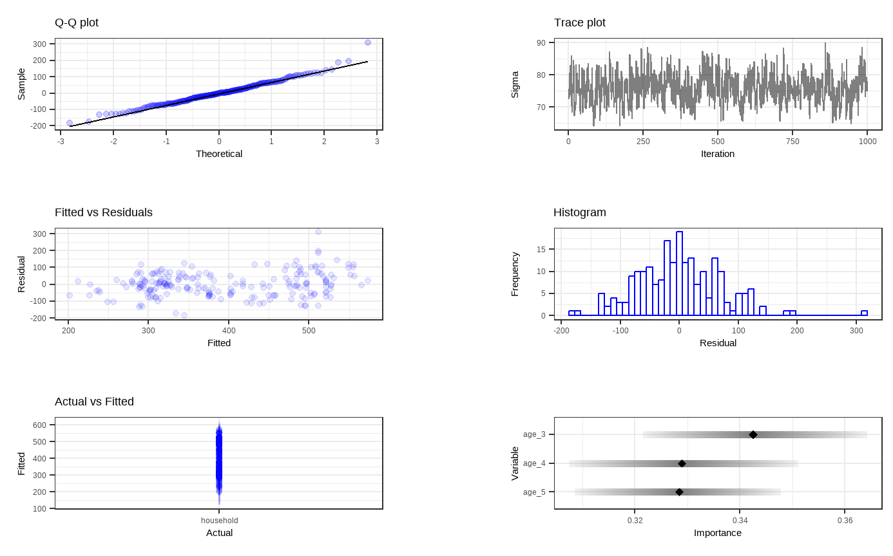
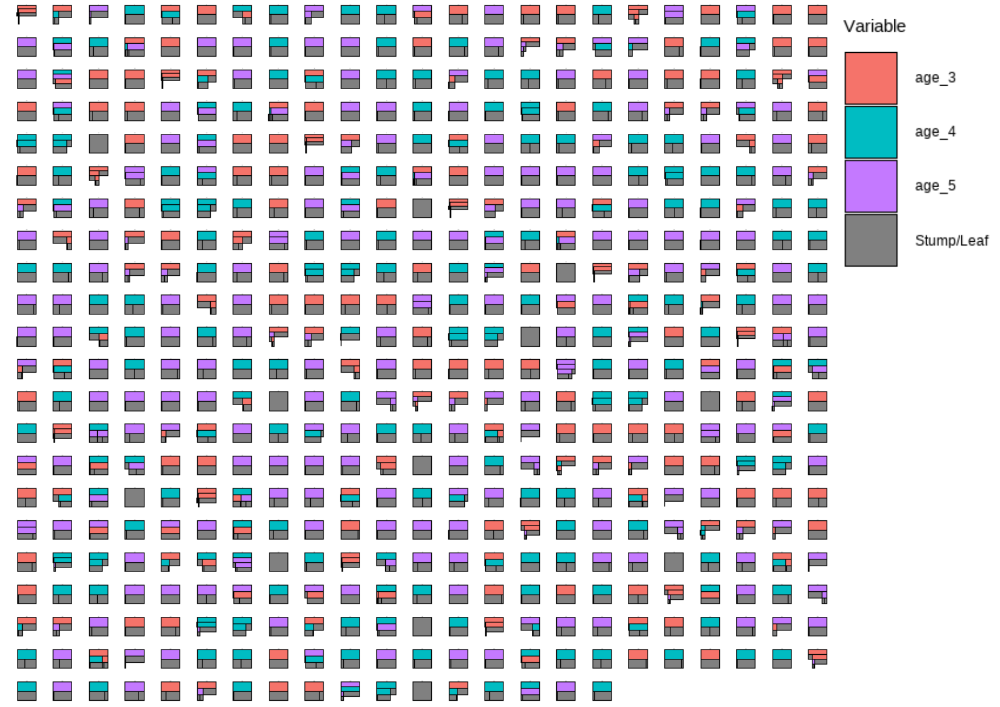
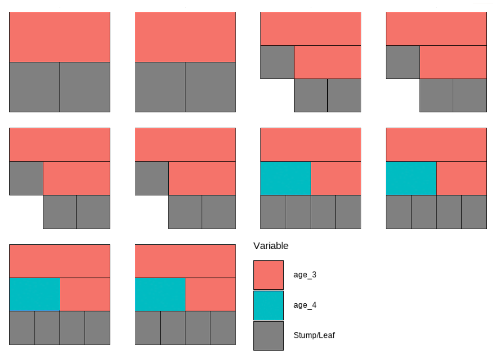
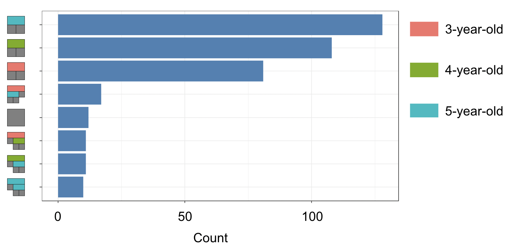
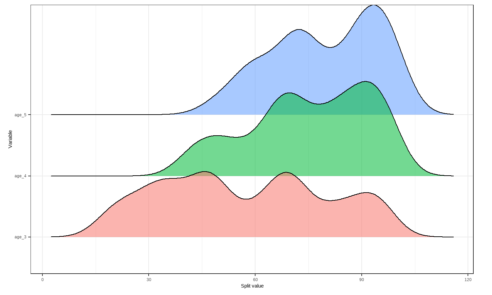
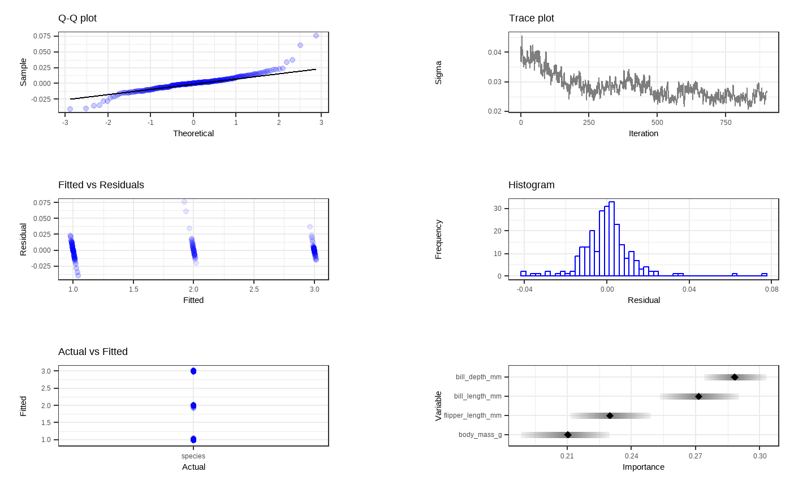
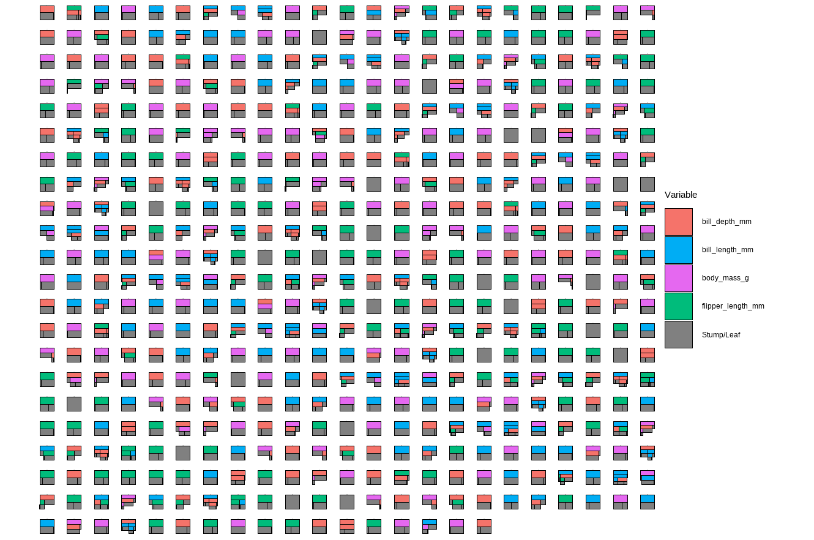
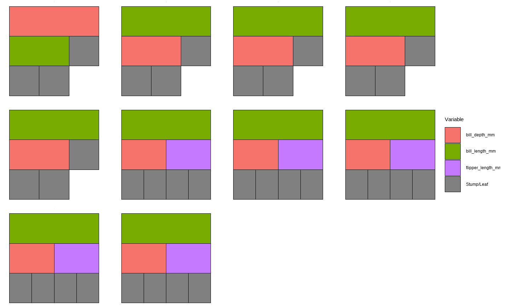
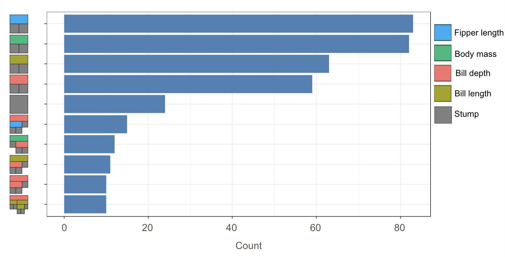
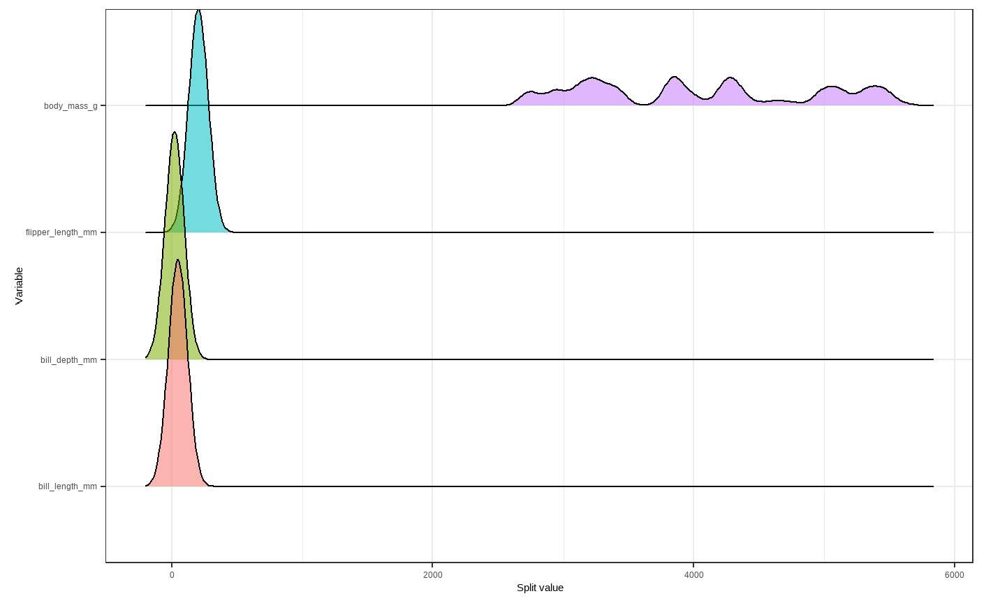

# Examples

## Example 1: Regression

```{r setup, include=FALSE}
knitr::opts_chunk$set(
  collapse = TRUE, 
  warning = FALSE,
  message = FALSE,
  fig.height = 4.75, 
  fig.width = 6.25,
  fig.align = 'center')
```


This example is inspired by the blog post “The Effect of Childhood Education on Wealth: Modeling with Bayesian Additive Regression Trees (BART)” on R-bloggers by Selcuk Disci. We aimed to explore how enrollment rates in early childhood education are associated with household net worth across all countries involved in the organisation of economic co-operation and development (OECD), using datasets provided by this organization. The OECD collects data on enrollment rates in early childhood education and household net worth from its member countries every year from 2000 to 2020 through standardized surveys and national statistics, ensuring consistent and comparable data across all countries involved.

According to OECD, the enrollment rates for each childhood age group, 3-year-old, 4-year-old, and 5-year-old are calculated by dividing the number of students enrolled in early childhood education and care (ECEC) of a particular age group by the total population of that age group. This calculation does not distinguish between full-time and part-time enrollment.

The household net worth indicator first calculates the overall financial status of households by measuring the total value of their assets (both financial, like stocks and savings, and non-financial, like real estate) and subtracting the total value of their outstanding debts (such as loans and mortgages). This result is then presented as a percentage of the households’ annual income. Essentially, this indicator provides a snapshot of the economic health and financial stability of households by showing how much wealth they have in relation to how much they earn each year.

\
\

We start here by loading some packages for the data and modeling, as well as cleaning and wrangling the data. 


```{r}
# install.packages("countrycode")
# install.packages("DALEXtra")
library(tidyverse)
library(tidymodels)
library(ggplot2)
library(countrycode)
library(plotly)
library(sysfonts)
library(showtext)
library(glue)
library(scales)
library(janitor)
library(DALEXtra)
library(dbarts)

#Loading the datasets
df_childhood <- read_csv("https://raw.githubusercontent.com/mesdi/blog/main/childhood.csv")
df_household <- read_csv("https://raw.githubusercontent.com/mesdi/blog/main/household.csv")

#Joining them by country and time
df <- 
  df_childhood %>% 
  left_join(df_household, by = c("country", "time")) %>% 
  na.omit()

#Wrangling the dataset
df_tidy <- 
  df %>%
  mutate(household = round(household, 2),
         childhood = round(childhood, 2),
         age = str_replace(age, "_", "-"),
         country_name = countrycode(country, "genc3c", "country.name")
         )


#Best 20 countries based on the household net worth in their last year
df_tidy %>% 
  group_by(country) %>% 
  slice_max(time) %>% 
  slice_max(household, n=20) %>% 
  mutate(age = fct_reorder(age, childhood, .desc = TRUE),
         country_name = fct_reorder(country_name, household, .desc = TRUE)) %>% 
  ggplot(aes(x=country_name, 
             y=childhood, 
             fill = age,
             #Hover text of the barplot
             text = glue("{country}\n%{childhood}\n{age}\nChildhood education"))) + 
  geom_col() +
  geom_line(aes(y=household/2, group = 1),
            color= "skyblue", 
            size=1) +
  #Adding the household net worth as a second(dual) y-axis
  scale_y_continuous(sec.axis = sec_axis(~.*2)) +
  scale_fill_viridis_d(name = "") +
  xlab("") + 
  ylab("") +
  theme_minimal() +
  theme(
    axis.text.x = element_text(angle = 60),
    axis.text.y = element_blank(),
    axis.text.y.right = element_blank(),
    panel.grid = element_blank(),
    legend.position = "none"
    ) -> p


#adding google font
font_add_google(name = "Henny Penny", family = "henny")
showtext_auto()

#setting font family for ggplotly 
font <- list(
  family= "Henny Penny", 
  size =5
  )

#Plotly chart
ggplotly(p, tooltip = c("text")) %>% 
  #Hover text of the line
  style(text = glue("{unique(p$data$country)}\n%{unique(p$data$household)}\nHousehold net worth"),traces = 6) %>% 
  layout(font=font)
```

This graph can show us what the household net worth looks like based on the education rate for each of the ages in the data set. Yellow represents age 3, teal is age 4, and purple is age 5. The blue trend line shows the household net worth for each country in the data.

\
\


```{r}
head(df_tidy)
```

\

In order to run the two different packages we use in this tutorial, `dbarts` and `tidymodels`, we start by splitting our data into a training set and and a test set. This way we can train the model and evaluate the performance on the test set.

```{r}
#Splitting the data into train and test sets
set.seed(1234)
df_split <- 
  df_tidy %>% 
  #Converting the levels to variables for modeling
  pivot_wider(names_from = age, values_from = childhood) %>% 
  clean_names() %>% 
  na.omit() %>% 
  initial_split() 

df_train <- training(df_split)
df_test <- testing(df_split)
```

```{r}
df_train
```


## `dbarts` package

Using the `dbarts` package, we can fit a model using the column numbers from our data. Our response variables called `x.train` is formed using the columns for age 3, age 4, and age 5 while `y.train` is formed using our response variable column.

We can also set `keeptrees = TRUE` in order to view some examples of what variable a tree chose, what the split rule is, and how long before the tree terminates.

```{r}
 # Fitting a BART model with default 1,000 iterations of 200 trees
set.seed(4343)
bartFit <- bart(x.train = as.matrix(df_train[,5:7]), y.train = as.numeric(unlist(df_train[,3])),keeptrees = TRUE, ndpost = 1000)

# Extracting trees from model
trees <- extract(bartFit, "trees")

 # Looking at some examples of trees from model
bartFit$fit$plotTree(chainNum = 1, sampleNum = 3, treeNum = 1)
bartFit$fit$plotTree(chainNum = 1, sampleNum = 3, treeNum = 140)
```

\
\

Using the `bartMan` package, we can look at some more interesting visualizations that show us some model diagnostics as well as what our trees look like in a fit model.


```{r, eval=FALSE}
 # Loading packages for BART visualization
library(bartMan)
library(ggridges)

bartDiag(model = bartFit, response = "household", burnIn = 1000, data = df_tidy)
```

\

```{r, echo=FALSE,, out.width = '80%', fig.align = 'center'}


```


\
\
For less computational time and simplicity, we reduce the number of trees as well as the number of iterations for each tree. We fit a new model with the same variables with 50 trees for 10 iterations.

```{r}
 # Fitting another BART model with fewer trees and less iterations
set.seed(4343)
bartFit50 <- bart(x.train = as.matrix(df_train[,5:7]), y.train = as.numeric(unlist(df_train[,3])), keeptrees = TRUE, ntree = 50, ndpost = 10)
```


```{r, eval = FALSE}
 # Extracting the tree data
trees_data50 <- extractTreeData(bartFit50, df_tidy)


 # Visualizing what each of the 50 trees look like over their 10 iterations
plotTrees(trees = trees_data50, fillBy = NULL, sizeNodes = TRUE)

# Viewing all 10 iterations of one tree
plotTrees(trees = trees_data50, treeNo = 13)
  
```


```{r, echo=FALSE,, out.width = '80%', fig.align = 'center'}


```

```{r, echo=FALSE,, out.width = '80%', fig.align = 'center'}


```
\

This plot shows us all of the iterations of the trees fit in the reduced model. Each color represents the variable that the tree is splitting on, and the gray represents a stump/leaf, or a terminal node.

\
\


Now, we are creating a couple more visuals of the trees using our model with 50 trees and 10 iterations. To start, we use `bartMan` again to create a bar plot that shows how many times each specific structure of tree, including which variable the tree splits on (but not its splitting rule value), shows up within the model. We also create a density plot that shows the splitting variables and the frequency at which each splitting rule value is chosen.

```{r, eval = FALSE}
 # Creating bar plot showing frequency of 8 most common trees from model
treeBarPlot(trees_data50, topTrees = 8, iter = NULL)

 # Creating density plot of variable split levels values
splitDensity(trees = trees_data50, data = df_tidy, display = 'ridge')


```

```{r, echo=FALSE,, out.width = '80%', fig.align = 'center'}


```

```{r, echo=FALSE,, out.width = '80%', fig.align = 'center'}


```

These visuals can be interesting to look at and interpret, but there is a discrepancy in the colors that are shown between the before tree plots, the density plot, and the bar plot. There is no legend argument for the `treeBarPlot`, so we do not actually know which variables are most commonly split on and where in the tree.

\
\

## `tidymodels` package

Now we are using the `tidymodels` package to fit our BART models. There are different steps to this package than there are for `dbarts`, but if you are familiar with machine learning in R, you should be able to follow along better.

```{r}
#Preprocessing
df_rec <- recipe(household ~ age_3 + age_4 + age_5, data = df_train) 


#Modeling with BART
df_spec <- 
  parsnip::bart() %>% 
  set_engine("dbarts", keeptrees = TRUE) %>% 
  set_mode("regression")  

#Workflow
df_wf <- 
  workflow() %>% 
  add_recipe(df_rec) %>% 
  add_model(df_spec)

#cross-validation for resamples
set.seed(12345)
df_folds <- vfold_cv(df_train)

#Resampling for the accuracy metrics
set.seed(98765)
df_rs <- 
  df_wf %>% 
  fit_resamples(resamples = df_folds)

#Computes the accuracy metrics  
collect_metrics(df_rs)

```

The output we see above are quality metrics for our model. Our RMSE average value shows the difference between the observed and predicted values of household net worth to be 85.2. The variable for household net worth ranges from 134 to 824. Given this context, our model has an could be considered to have a decent performance, but it could be better. 

The $R^2$ value indicates the model fit. We observe a value of 0.528, which we would like to be closer to 1 in order for the model to explain more variability in the data.

\
\

For this second model, we are using grid search to tune the priors of the model. These priors include the trees, terminal node coefficient, and the exponential component of the prior distribution for these terminal node parameters.

```{r}
# Model tuning with grid search
df_spec <- 
  parsnip::bart(
    trees = tune(),
    prior_terminal_node_coef = tune(),
    prior_terminal_node_expo = tune()
  ) %>% 
  set_engine("dbarts") %>% 
  set_mode("regression")

#parameter object
rf_param <- 
  workflow() %>% 
  add_model(df_spec) %>% 
  add_recipe(df_rec) %>% 
  extract_parameter_set_dials() %>% 
  finalize(df_train)

#space-filling design with integer grid argument
df_reg_tune <-
  workflow() %>% 
  add_recipe(df_rec) %>% 
  add_model(df_spec) %>% 
  tune_grid(
    df_folds,
    grid = 20,
    param_info = rf_param,
    metrics = metric_set(rsq)
  )

#Selecting the best parameters according to the r-square
rf_param_best <- 
  select_best(df_reg_tune, metric = "rsq") %>% 
  select(-.config)

#Final estimation with the object of best parameters
final_df_wflow <- 
  workflow() %>% 
  add_model(df_spec) %>% 
  add_recipe(df_rec) %>% 
  finalize_workflow(rf_param_best)

set.seed(12345)
final_df_fit <- 
  final_df_wflow %>% 
  last_fit(df_split)

#Computes final the accuracy metrics 
collect_metrics(final_df_fit)

# A tibble: 2 x 4
#  .metric .estimator .estimate .config             
#  <chr>   <chr>          <dbl> <chr>               
#1 rmse    standard      84.5   Preprocessor1_Model1
#2 rsq     standard       0.645 Preprocessor1_Model1
```


The RMSE average value shows the difference between the observed and predicted values of household net worth to be 84.5. This is just slightly better than the previous model. 

For this second model, we observe a value of 0.645, which is better than the first model, but still a bit far from 1.

\
\


## Example 2: Classification

Now we are using classification with the `tidymodels` package instead of regression. The Palmer Penguins data set that lives in a package we can load easily here. We can use this model to predict what species a penguin is out of three different observed options: Adelie, Chinstrap, and Gentoo. This data set contains measurements from many observations of the three different species of penguins. 

These data were collected from 2007 - 2009 by Dr. Kristen Gorman with the Palmer Station Long Term Ecological Research Program, part of the US Long Term Ecological Research Network. The data were imported directly from the Environmental Data Initiative (EDI) Data Portal, and are available for use by CC0 license (“No Rights Reserved”) in accordance with the Palmer Station Data Policy.

```{r}
# Loading data 
library(palmerpenguins)
data(penguins)

head(penguins)
```

## `dbarts` package

To start to build our models, we again have to split the data into training and test sets.

```{r}
#Splitting the data into train and test sets
set.seed(1234)
penguin_split <- 
  penguins %>%
  na.omit() %>% 
  initial_split() 

penguin_train <- training(penguin_split)
penguin_test <- testing(penguin_split)
```


Now we will fit the model in a similar way to the regression model from before, except now with our penguin data specifications. We are using the variables for bill length, bill depth, flipper length, and body mass of the penguins to predict their species. We can view some examples of trees within the model as well.

```{r}
 # Fitting a BART model with 200 trees with 1000 iterations
set.seed(4343)
p.bartFit <- bart(x.train = as.matrix(penguin_train[,3:6]), y.train = as.numeric(unlist(penguin_train[,1])), keeptrees = TRUE, ndpost = 1000)

trees <- extract(p.bartFit, "trees")

 # Looking at some examples of trees from model
p.bartFit$fit$plotTree(chainNum = 1, sampleNum = 3, treeNum = 112)
p.bartFit$fit$plotTree(chainNum = 1, sampleNum = 3, treeNum = 140)
```

\


```{r, eval=FALSE}
bartDiag(model = p.bartFit, data = penguins, response = "species", burnIn = 0)
```


```{r, echo=FALSE,, out.width = '80%', fig.align = 'center'}


```

Here we can see some diagnostic plots of our model. The two upper rows show if our model has a reasonable performance of the residuals. 

\
\

Using the `bartMan` package we can create similar visualizations to view the trends of the shapes of the trees and their splitting variables and values. We will again start with a smaller model with less trees and less iterations.

```{r}
# Fitting another BART model with fewer trees and less iterations
set.seed(4343)
p.bartFit50 <- bart(x.train = as.matrix(penguin_train[,3:6]), y.train = as.numeric(unlist(penguin_train[,1])), keeptrees = TRUE, ntree = 50, ndpost = 10)

```


```{r, eval = FALSE}

 # Extracting the tree data
p.trees_data <- extractTreeData(p.bartFit50, penguins)

 # Visualizing what each of the 50 trees look like over their 10 iterations
plotTrees(trees = p.trees_data, fillBy = NULL, sizeNodes = TRUE)

# Viewing all 10 iterations of one tree
plotTrees(trees = p.trees_data, treeNo = 13)


```

```{r, echo=FALSE,, out.width = '80%', fig.align = 'center'}


```

```{r, echo=FALSE,, out.width = '80%', fig.align = 'center'}


```


In visualizing our model of each of the 50 trees each with 10 iterations, we can see that each of the four variables have appeared in our trees as splitting variables...

But this time, since we have more variables in the data to choose from, we can use these next plots to help us see which variables are considered most important in the model.


```{r, eval = FALSE}
 # Creating bar plot showing frequency of 10 most common trees from model
treeBarPlot(p.trees_data, iter = NULL, topTrees = 10, removeStump = FALSE)


 # Creating density plot of variable split levels values
splitDensity(trees = p.trees_data, data = df_tidy, display = 'ridge')

```
We can see from our bar plot of the 8 most common tree configurations, that we have idk bro

```{r, echo=FALSE,, out.width = '80%', fig.align = 'center'}


```

```{r, echo=FALSE,, out.width = '80%', fig.align = 'center'}


```


## `tidymodels` package

When we are fitting our model using `tidymodels`, we use a very similar layout to the code we use for the regression model. The differences here are that we would change the mode to classification rather than regression and our model evaluation metrics also need to change. Using the diagnostic plots from the `dbarts` model, we can decide to take out the body mass variable from this model.


```{r}
#Preprocessing
penguin_rec <- recipe(species ~ bill_length_mm + bill_depth_mm + flipper_length_mm , data = penguin_train) 

#Modeling with BART
penguin_spec <- 
  parsnip::bart() %>% 
  set_engine("dbarts") %>% 
  set_mode("classification")  

#Workflow
penguin_wf <- 
  workflow() %>% 
  add_recipe(penguin_rec) %>% 
  add_model(penguin_spec)

#cross-validation for resamples
set.seed(12345)
penguin_folds <- vfold_cv(penguin_train)

classification_metrics <- metric_set(accuracy)

# Resampling for the classification metrics
penguin_rs <- 
  penguin_wf %>% 
  fit_resamples(resamples = penguin_folds, metrics = classification_metrics)

# Compute the classification metrics
collect_metrics(penguin_rs)
```

The output from this model shows the proportion of correctly classified instances of species from our model. So, our model correctly classifies species of penguin 64% of the time. This value is not much higher than 50%, so we might want to look a bit more at fixing our model.

\
\

This next model has uses a binary output sex rather than a three-level factor like the species variable.

```{r}
#Preprocessing
penguin_rec <- recipe(sex ~ bill_length_mm + bill_depth_mm+ flipper_length_mm + species, data = penguin_train) 

#Modeling with BART
penguin_spec <- 
  parsnip::bart() %>% 
  set_engine("dbarts") %>% 
  set_mode("classification")  

#Workflow
penguin_wf <- 
  workflow() %>% 
  add_recipe(penguin_rec) %>% 
  add_model(penguin_spec)

#cross-validation for resamples
set.seed(12345)
penguin_folds <- vfold_cv(penguin_train)

classification_metrics <- metric_set(accuracy, precision)

# Resampling for the classification metrics
penguin_rs <- 
  penguin_wf %>% 
  fit_resamples(resamples = penguin_folds, metrics = classification_metrics)

# Compute the classification metrics
collect_metrics(penguin_rs)
```

We are able to view both accuracy and precision estimates for this model as it has a binary response variable. From the average accuracy, we can see that this model correctly classifies a penguin's sex 88% of the time. We could say here that the model is pretty good. 

The precision is calculated using $\frac{\text{True Positive}}{\text{True Positive + False Positive}}$. If the cost of false negatives is high in our model, we want to minimize how many there are. In the context of our model, a positive value is male while a negative value is female. With a precision value of 88%, we can say that when the model predicts a positive outcome (male) it is correct about 88% of the time.

## References

- AlanInglis. (n.d.). GitHub - AlanInglis/bartMan: Visualisations for posterior evaluation of BART models. GitHub. https://github.com/AlanInglis/bartMan?tab=readme-ov-file

- Bayesian additive regression trees (BART) - bart. - bart • parsnip. (n.d.). https://parsnip.tidymodels.org/reference/bart.html 

- Disci, S. (2022, December 8). The effect of childhood education on wealth: Modeling with bayesian additive regression trees (BART): R-bloggers. R. https://www.r-bloggers.com/2022/12/the-effect-of-childhood-education-on-wealth-modeling-with-bayesian-additive-regression-trees-bart/#google_vignette 

- Inglis, A., Parnell, A. C., & Hurley, C. (2024). Visualisations for Bayesian Additive Regression Trees. Journal of Data Science, Statistics, and Visualisation, 4(1). https://doi.org/10.52933/jdssv.v4i1.79

- Introduction to palmerpenguins. (n.d.). https://allisonhorst.github.io/palmerpenguins/articles/intro.html

- OECD (2024), Enrolment rate in early childhood education (indicator). doi: 10.1787/ce02d0f9-en (Accessed on 30 April 2024)

- OECD (2024), Household net worth (indicator). doi: 10.1787/2cc2469a-en (Accessed on 30 April 2024)


