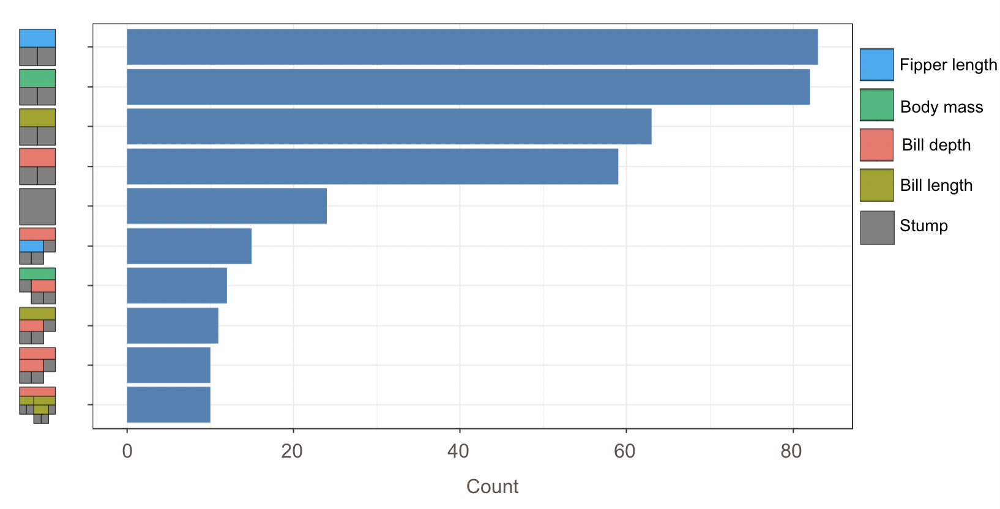

# Classification Example

```{r setup, include=FALSE}
knitr::opts_chunk$set(
  collapse = TRUE, 
  warning = FALSE,
  message = FALSE,
  fig.height = 4.75, 
  fig.width = 6.25,
  fig.align = 'center')
```

## Background & Data

In this section, we shift away from regression BART models and demonstrate how to fit a BART model for classification purpose. We aim to make use of the `palmerpenguins` dataset to build a BART model to predict what species a penguin is out of three different observed options: Adelie, Chinstrap, and Gentoo based on their various traits.

These data were collected from 2007 to 2009 by Dr. Kristen Gorman with the Palmer Station Long Term Ecological Research Program, which is part of the US Long Term Ecological Research Network. The data were imported directly from the Environmental Data Initiative (EDI) Data Portal, and are available for use by CC0 license ("No Rights Reserved") in accordance with the Palmer Station Data Policy.

```{r}
# Load packages
library(tidyverse)
library(tidymodels)
library(ggplot2)
library(countrycode)
library(plotly)
library(sysfonts)
library(showtext)
library(glue)
library(scales)
library(janitor)
library(DALEXtra)
library(dbarts)
# Loading data 
# install.packages("palmerpenguins")
library(palmerpenguins)
data(penguins)
head(penguins)
```


## Data Wrangling

Before fitting the models, we again split the data into training and test sets.

```{r}
#Splitting the data into train and test sets
set.seed(1234)
penguin_split <- 
  penguins %>%
  na.omit() %>% 
  initial_split() 

penguin_train <- training(penguin_split)
penguin_test <- testing(penguin_split)
```

## Implementation

### `dbarts` package

Now we will fit the model in a similar way to the regression model as described in the last chapter, except now with our penguin data specifications. We are using the variables for bill length, bill depth, flipper length, and body mass of the penguins to predict their species. We can view some examples of trees within the model as well.

```{r}
 # Fitting a BART model with 200 trees with 1000 iterations
set.seed(4343)
p.bartFit <- bart(x.train = as.matrix(penguin_train[,3:6]), y.train = as.numeric(unlist(penguin_train[,1])), keeptrees = TRUE, ndpost = 1000)

trees <- extract(p.bartFit, "trees")

 # Looking at some examples of trees from model
p.bartFit$fit$plotTree(chainNum = 1, sampleNum = 3, treeNum = 112)
p.bartFit$fit$plotTree(chainNum = 1, sampleNum = 3, treeNum = 140)
```

\
\

### `bartMan` package

```{r, eval=FALSE}
bartDiag(model = p.bartFit, data = penguins, response = "species", burnIn = 0)
```
```{r, echo=FALSE,, out.width = '80%', fig.align = 'center'}
knitr::include_graphics("image/class-diag.png")
```

Shown above are six general diagnostic plots for the BART regression fit on our dataset. Top left: A QQ-plot of the residuals after fitting the model. Top right: trace plot of $\sigma$ from MCMC iteration. Middle left: Residuals versus fitted values with 95% credible intervals. Middle right: A histogram of the residuals. Bottom Left: Actual values versus fitted values with 95% credible intervals. (This is unfornately not working properly due to unknown reasons). Bottom right: Variable importance plot with 25 to 75% quantile interval shown. In our case, the BART model decides that the body mass variable is the least important to predict penguin species.

Then, we want to visualize all the trees we fitted across all iterations. For less computational time and simplicity, we reduce the number of trees as well as the number of iterations for each tree. With `dbarts`, we fit a new model with the same variables with 50 trees for 10 iterations.

```{r}
# Fitting another BART model with fewer trees and less iterations
set.seed(4343)
p.bartFit50 <- bart(x.train = as.matrix(penguin_train[,3:6]), y.train = as.numeric(unlist(penguin_train[,1])), keeptrees = TRUE, ntree = 50, ndpost = 10, verbose = FALSE)
```


```{r, eval = FALSE}
 # Extracting the tree data
p.trees_data <- extractTreeData(p.bartFit50, penguins)

 # Visualizing what each of the 50 trees look like over their 10 iterations
plotTrees(trees = p.trees_data, fillBy = NULL, sizeNodes = TRUE)
```

```{r, echo=FALSE,, out.width = '80%', fig.align = 'center'}
knitr::include_graphics("image/class-all-tree.png")
```

In the plot above, each little box represents a single tree. There are 500 boxes, thus 500 = 50 $\cdot$ 10 trees, because it is showing all the trees (50 trees) built in all iterations after the burn-in period (10 iterations) in the reduced model. Different colors represent different variables that a tree is splitting on, and the gray represents a stump/leaf, or a terminal node.

While this plot is useful, it is hard to get insight from it because that is too much to look at at one time. To deal with that, we can specify one tree to look at all the iterations (10) of it. Here we are using the $13^{th}$ as an example:

```{r, eval = FALSE}
# Viewing all 10 iterations of one tree
plotTrees(trees = p.trees_data, treeNo = 13)
```

```{r, echo=FALSE,, out.width = '80%', fig.align = 'center'}
knitr::include_graphics("image/class-one-tree.png")
```

However, that is only the information of one tree. An even better alternative to grab information efficiently is to use the `treeBarPlot` function in the `bartMan` package. This function creates a bar plot that shows how many times each specific structure of tree, including which variable the tree splits on (but not its splitting rule value), shows up within the model. We also create a density plot that shows the splitting variables and the frequency at which each splitting rule value is chosen.

```{r, eval = FALSE}
 # Creating bar plot showing frequency of 10 most common trees from model
treeBarPlot(p.trees_data, iter = NULL, topTrees = 10, removeStump = FALSE)

 # Creating density plot of variable split levels values
splitDensity(trees = p.trees_data, data = df_tidy, display = 'ridge')
```

```{r, echo=FALSE,, out.width = '80%', fig.align = 'center'}

```

```{r, echo=FALSE,, out.width = '80%', fig.align = 'center'}
knitr::include_graphics("image/class-dens.png")
```

Note: These visuals can be interesting to look at and interpret, but there is a discrepancy in the colors that are shown between the 500-tree plot, the density plot, and the bar plot. There is no legend argument for the `treeBarPlot`, so we manually added in the legends for these later plots. We made sure that the variables match the colors as described in the legend by checking [original code](https://github.com/AlanInglis/bartMan/blob/master/R/treeBarPlot.R) of the function `treeBarPlot`.

### `tidymodels` package

Next, we decide to use the `tidymodels` package to fit our BART model and assess its overall performance. This is because `tidymodels` is more comprehensive and provides an standardized workflow for not only training and testing the model, but also performing cross-validation on the model. The steps for this package are universal for machine learning in R.

When we are fitting our model using `tidymodels`, we use a very similar layout to the code from our regression model in the last chapter. However, we need to change the mode to classification rather than regression and change to classification evaluation metrics.  Using the bottom-right diagnostic plot from the `dbarts` model, we decide to take out the body mass variable to fit our new BART model with `tidymodels`.

```{r}
#Preprocessing
penguin_rec <- recipe(species ~ bill_length_mm + bill_depth_mm + flipper_length_mm , data = penguin_train) 

#Modeling with BART
penguin_spec <- 
  parsnip::bart() %>% 
  set_engine("dbarts") %>% 
  set_mode("classification")  

#Workflow
penguin_wf <- 
  workflow() %>% 
  add_recipe(penguin_rec) %>% 
  add_model(penguin_spec)

#cross-validation for resamples
set.seed(12345)
penguin_folds <- vfold_cv(penguin_train)

classification_metrics <- metric_set(accuracy)

# Resampling for the classification metrics
penguin_rs <- 
  penguin_wf %>% 
  fit_resamples(resamples = penguin_folds, metrics = classification_metrics)

# Compute the classification metrics
collect_metrics(penguin_rs)
```

The accuracy of this model shows that our model correctly classifies species of penguin 64% of the time. 

\
\

In our methodology chapter, we discussed BART probit, which is specifically for binary outputs. Thus, we fit a model that takes the same set of attributes to predict penguins' sex.

```{r}
#Preprocessing
penguin_rec <- recipe(sex ~ bill_length_mm + bill_depth_mm+ flipper_length_mm, data = penguin_train) 

#Modeling with BART
penguin_spec <- 
  parsnip::bart() %>% 
  set_engine("dbarts") %>% 
  set_mode("classification")  

#Workflow
penguin_wf <- 
  workflow() %>% 
  add_recipe(penguin_rec) %>% 
  add_model(penguin_spec)

#cross-validation for resamples
set.seed(12345)
penguin_folds <- vfold_cv(penguin_train)

classification_metrics <- metric_set(accuracy, precision)

# Resampling for the classification metrics
penguin_rs <- 
  penguin_wf %>% 
  fit_resamples(resamples = penguin_folds, metrics = classification_metrics)

# Compute the classification metrics
collect_metrics(penguin_rs)
```

We are able to view both accuracy and precision estimates for this model as it has a binary response variable. From the overall accuracy, we can see that this model correctly classifies a penguin's sex 87.1% of the time, which is pretty good.

The precision is calculated using $\frac{\text{True Positive}}{\text{True Positive + False Positive}}$. In our context, it measures the proportion of true predictions among all female predictions. With the observed precision value, when the model predicts a penguin to be a female, it is correct about 86.7% of the time.

## References

-   AlanInglis. (n.d.). GitHub - AlanInglis/bartMan: Visualisations for posterior evaluation of BART models. GitHub. <https://github.com/AlanInglis/bartMan?tab=readme-ov-file>

-   Bayesian additive regression trees (BART) - bart. - bart • parsnip. (n.d.). <https://parsnip.tidymodels.org/reference/bart.html>

-   Disci, S. (2022, December 8). The effect of childhood education on wealth: Modeling with bayesian additive regression trees (BART): R-bloggers. R. <https://www.r-bloggers.com/2022/12/the-effect-of-childhood-education-on-wealth-modeling-with-bayesian-additive-regression-trees-bart/#google_vignette>

-   Inglis, A., Parnell, A. C., & Hurley, C. (2024). Visualisations for Bayesian Additive Regression Trees. Journal of Data Science, Statistics, and Visualisation, 4(1). <https://doi.org/10.52933/jdssv.v4i1.79>

-   Introduction to palmerpenguins. (n.d.). <https://allisonhorst.github.io/palmerpenguins/articles/intro.html>

-   OECD (2024), Enrolment rate in early childhood education (indicator). doi: 10.1787/ce02d0f9-en (Accessed on 30 April 2024)

-   OECD (2024), Household net worth (indicator). doi: 10.1787/2cc2469a-en (Accessed on 30 April 2024)