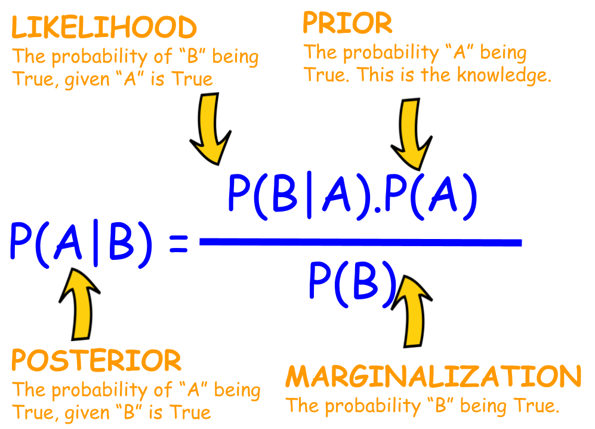

# Introduction

Bayesian models operate on the principles of Bayesian statistics, which use probability to quantify uncertainty in model parameters. The core components of Bayesian models include priors, likelihood functions, and posteriors. **Priors** represent our initial beliefs about the parameters before observing any data. The **likelihood function** quantifies how probable the observed data is, given certain parameter values. Combining these, we use Bayes' theorem to update our beliefs and obtain the **posterior** distribution of our parameters, which provides a new, data-informed understanding of the parameter values.

```{r, echo=FALSE, fig.cap="A visual representation of the prediction process of a sum-of-tree model.", out.width = '80%', fig.align = 'center'}

```

Given this Bayesian framework, most traditional Bayesian models actually struggle with complex, non-linear relationships and interactions among variables. This limitation leads us to a natural solution: decision trees! Decision trees are capable of handling non-linearity, facilitating automatic variable selection, and is extremely flexible. However, a single decision tree often falls short, as it can easily overfit and may not capture the full complexity of the data. To address this, we can employ an large ensemble of decision trees where each of them contribute only a part to the final estimate. That is, the output of each tree can be thought of as a "residual" that tweak the final output, which would be the sum of the outputs from all trees, by only a little bit. To ensure that the contribution of each tree is small, we can use Bayesian priors to keep the trees shallow and dependent on others to adjust themselves, thus enhancing both the robustness and predictive performance of the model.

And that is the idea of the Bayesian "sum-of-trees" models, or Bayesian Additive Regression Trees (BART), which will be the focus of this tutorial.
